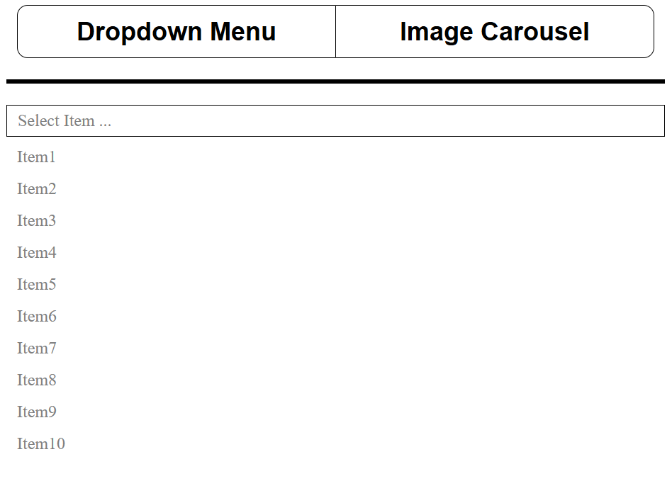
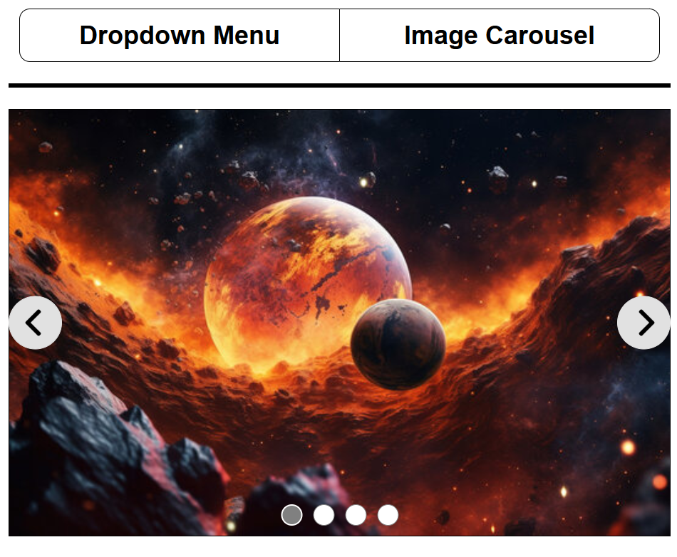

# odin-dropdown-carousel
## Basic Dropdown Menu and Image Carousel

This little project is part of [The Odin Project's JavaScript Path](https://www.theodinproject.com/lessons/node-path-javascript-dynamic-user-interface-interactions).

# Demo
Check the demo [here](https://amroalshaban.github.io/odin-dropdown-carousel/).

# Screenshots



# How to Use
## Dropdown Menu

To create a dropdown menu:
1. Create a `<div>` element with class name `dropdown-menu-content`.
2. Inside this div, create another `<div>` element with class name `dropdown-block`. 
3. Inside `dropdown-block`, create a `<div>` with class name `select-options` to define the default dropdown view.
4. Finally, you can insert items by creating `<div>` elements with class name `item` inside `dropdown-block` (underneath `select-options`). 

Example:

```html
<div class="dropdown-menu-content">
    <div class="dropdown-block">
        <div class="select-options">Select Item ...</div>
    
        <div class="item">Item1</div>
        <div class="item">Item2</div>
        <div class="item">Item3</div>
        <div class="item">Item4</div>
        <div class="item">Item5</div>
        <div class="item">Item6</div>
        <div class="item">Item7</div>
        <div class="item">Item8</div>
        <div class="item">Item9</div>
        <div class="item">Item10</div>
    </div>
</div>
```

## Image Carousel

To create an image carousel:
1. Create a `<div>` with class name `image-carousel-content`.
2. Inside this div, create another `<div>` with class name `carousel-block`, which will hold all the images that you would like to render.
3. For each image, create a `<div>` with class name `carousel-image` inside `carousel-block`. 
4. Inside each `carousel-image` div, <b>add only one</b> `` tag with the appropriate `src` attribute for the image. If more than one image tag is inside a `carousel-image`, the extra images will be ignored.

Example:

```html
<div class="image-carousel-content">
    <div class="carousel-block">
        <div class="carousel-image">
            
        </div>
        <div class="carousel-image">
            
        </div>
        <div class="carousel-image">
            
        </div>
        <div class="carousel-image">
            
        </div>
    </div>
</div>
```

You can add styles however you see fit, but `dropdown-menu-content` and `image-carousel-content` already come with custom styles.